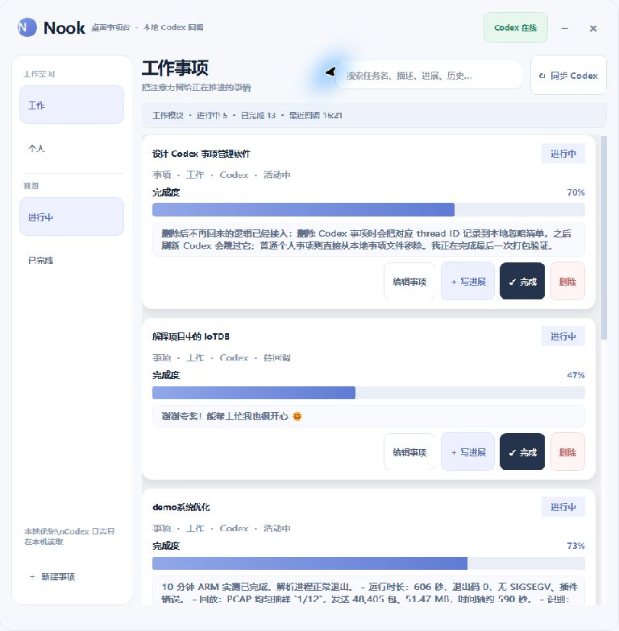

# Nook

Nook 是一个轻量的 Windows 桌面事项管理器：它把 Codex 工作任务、个人事项和工作待办放进同一个桌面窗口，实时显示进度与历史记录，替代传统便签，减少在多个任务之间来回切换的负担。

> 本仓库是 Nook 的用户发布页，仅提供 Windows 安装包、功能介绍和使用说明，不公开源代码。

## 下载与安装

当前版本：`0.1.0`

直接下载并双击安装包：

[下载 Nook-Setup-0.1.0.exe](./Nook-Setup-0.1.0.exe)

安装程序会自动完成以下工作：

1. 安装 Nook 及其运行库。
2. 创建开始菜单快捷方式。
3. 可选创建桌面快捷方式。
4. 安装完成后可以直接启动 Nook。

Nook 支持 Windows 10/11（64 位），不需要安装 Python，也不需要执行命令行。默认安装到当前用户目录，不需要管理员权限。

如果 Windows SmartScreen 第一次运行时显示提示，请确认安装包来自本仓库后选择“仍要运行”。

## Nook 能做什么

- 工作 / 个人两个模块，工作区域更适合集中管理较多任务。
- 进行中 / 已完成分栏，完成的事项会进入历史记录，不会凭空消失。
- 新建、编辑、删除、完成和重新打开事项。
- 设置任务描述、截止时间、优先级、下一步行动和手动完成度。
- 在任务卡片中持续追加进展，保留完整的历史时间线。
- 搜索任务名、描述、当前进展、全部历史进展、下一步行动和 Codex 摘要。
- 绑定本机 Codex 项目，刷新时只更新已经绑定的事项，不自动创建任务，也不会擅自标记完成。
- 显示 Codex 在线 / 离线状态，并同步可识别的进度摘要。
- 一次性提醒：到点通过 Windows 通知和系统托盘提醒。
- 普通桌面窗口：支持最小化、任务栏、`Alt+Tab`、被其他应用覆盖，以及四边四角拖拽调整大小。
- 单例模式：连续双击安装后的 Nook，只会唤醒已有窗口，不会打开多个实例。

## 基本使用

### 新建普通事项

1. 打开 Nook，选择“工作”或“个人”模块。
2. 点击“新建事项”。
3. 填写标题、描述、截止时间、优先级和下一步行动。
4. 需要提醒时开启提醒并选择时间。
5. 保存后，在任务卡片中拖动进度或补充进展。

### 完成与查看历史

- 只有手动点击“完成”后，事项才会进入“已完成”。
- 在“已完成”中可以按完成日期查看历史记录。
- 重新打开事项后，它会回到“进行中”，原有进展不会丢失。
- 删除是明确操作；删除后的 Codex 绑定不会在后续刷新时自动恢复。

### 使用 Codex 联动

1. 点击“同步 Codex”，刷新本机当前可用的 Codex 项目。
2. 新建或编辑事项，在“Codex 项目”中选择要绑定的项目。
3. 再次同步时，Nook 只更新已经绑定事项的摘要、活跃状态和日志中明确写出的百分比。
4. 完成状态仍由你控制，Codex 不会自动替你完成任务。

Nook 默认从本机的 `%USERPROFILE%\.codex\sessions` 读取 Codex session 日志，也支持通过 `CODEX_HOME` 指定其他目录。日志和任务内容不会上传到云端。

## 提醒说明

- 提醒是一次性的，触发后会记录到该事项的历史进展。
- 编辑事项并修改提醒时间，可以重新安排提醒。
- Nook 即使最小化到任务栏或隐藏到系统托盘，也会继续检查提醒。
- 已完成事项不会继续提醒。

## 数据与隐私

- 任务数据保存在 `%APPDATA%\Nook\tasks.json`。
- 每次保存前会保留 `.bak` 备份，便于恢复。
- Codex 日志只在本机读取。
- 本仓库不包含个人任务、Codex 日志、令牌或本机配置。

## 常见问题

### 双击后没有反应

请从开始菜单重新启动 Nook；如果仍然没有反应，先卸载后重新安装当前安装包。安装包已经包含运行 Nook 所需的全部运行库。

### 为什么刷新 Codex 后没有新增任务

这是设计如此：同步只更新已经绑定的事项，不会自动把 Codex 项目批量添加到你的任务列表。请先在“新建事项”或“编辑事项”中选择 Codex 项目。

### 如何让 Nook 不挡住其他软件

Nook 是普通窗口，不会强制置顶。可以直接最小化、使用 `Alt+Tab` 切换，或把窗口调整为适合桌面的大小。

## 校验信息

安装包：`Nook-Setup-0.1.0.exe`  
SHA-256：`84F21BA7C536BAA64F87E3E8F485CED17B972644A6E02EB3AB648B2C0DC399D2`

## 许可证

Nook 使用 MIT License 发布。当前仓库只提供编译后的 Windows 安装包和用户文档。
